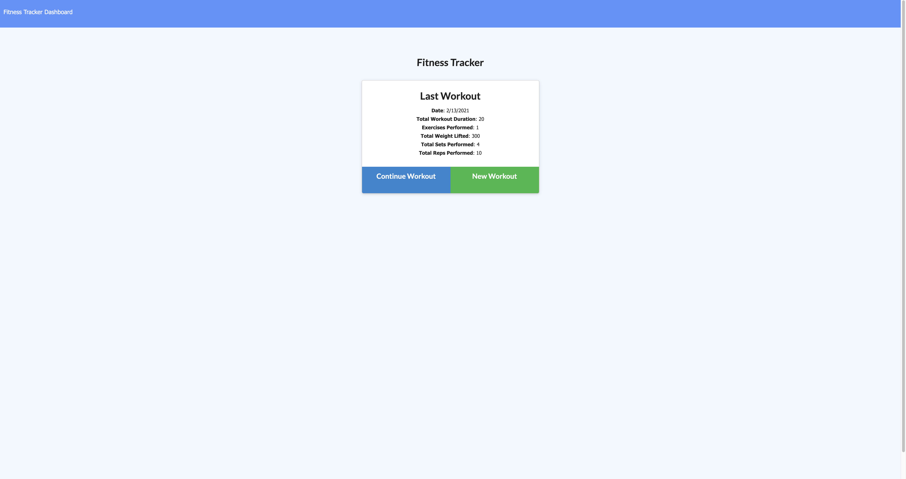

# Workout Tracker

> On this web application, the user can view, create and track daily workouts.

### Table of Contents

- [Description](#description)
- [Installation](#installation)
- [Technologies](#technologies)
- [How To Use](#how-to-use)
- [Links](#links)
- [Author Info](#author-info)

---

## Description
In this web application, user will input numerous  exercise in a workout. Once the workout is saved, the user can click on the 'Dashboard' link to view his or her workout stats for the week. The home page displays information for the user's last workout. 

---

## Installation
No requirements to use the app. 

---
[Back To The Top](#read-me-template)

## Technologies
HTML, CSS, JavaScript, Express.js, Node.js, MongoDB, MongoDB Atlas, and Mongoose.js

[Back To The Top](#read-me-template)

---

## How To Use
see Description for how to use this app.
   
   [Back To The Top](#read-me-template)
   
---

## Links

Link to site:
https://hidden-river-35633.herokuapp.com/?id=602a96a9a964e20015322120

Link to GitHub repository:
https://github.com/deleonfrancis/workout_tracker

[Back To The Top](#read-me-template)

---

## Author Info

- E-mail: dxfrancis.coding@gmail.com

[Back To The Top](#read-me-template)

---

## License

MIT
Copyright (c) 2021 Deleon Francis

Permission is hereby granted, free of charge, to any person obtaining a copy
of this software and associated documentation files (the "Software"), to deal
in the Software without restriction, including without limitation the rights
to use, copy, modify, merge, publish, distribute, sublicense, and/or sell
copies of the Software, and to permit persons to whom the Software is
furnished to do so, subject to the following conditions:

The above copyright notice and this permission notice shall be included in all
copies or substantial portions of the Software.

THE SOFTWARE IS PROVIDED "AS IS", WITHOUT WARRANTY OF ANY KIND, EXPRESS OR
IMPLIED, INCLUDING BUT NOT LIMITED TO THE WARRANTIES OF MERCHANTABILITY,
FITNESS FOR A PARTICULAR PURPOSE AND NONINFRINGEMENT. IN NO EVENT SHALL THE
AUTHORS OR COPYRIGHT HOLDERS BE LIABLE FOR ANY CLAIM, DAMAGES OR OTHER
LIABILITY, WHETHER IN AN ACTION OF CONTRACT, TORT OR OTHERWISE, ARISING FROM,
OUT OF OR IN CONNECTION WITH THE SOFTWARE OR THE USE OR OTHER DEALINGS IN THE
SOFTWARE.
